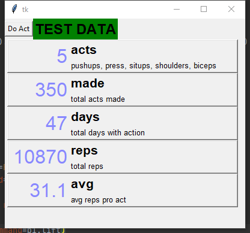

# Simple exercise counter
tkinter, sqlite

## Idea:
Create and save activities to database.
Than it's possible to save activity with its quantity, datetime is saving automatically

# Under Construction...

